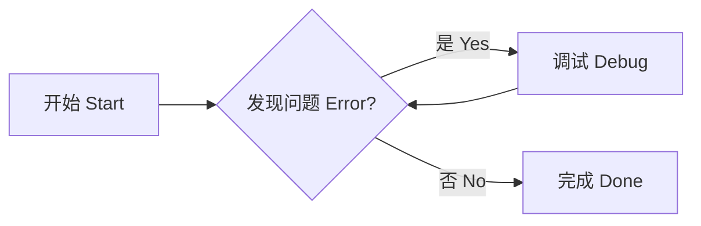

# 阅读与渲染验证

这是一段没有链接和特殊组件的普通正文。切换「随应用 · 舒适」「书页 · 宋体」「紧凑 · 技术笔记」，可以比较字体、行距与栏宽。切换应用深色主题，对照与阅读区应使用协调的底色。

## Mermaid 图表



## 代码行号

```python title="example.py" linenums="1"
values = []
for index in range(1, 21):
    values.append(index)

def average(items):
    return sum(items) / len(items)

print(values)
print(average(values))
print("行号应与每一行代码对齐")
```

## 脚注与图标

悬浮或键盘聚焦这个脚注编号可以看到说明[^example]。按 Esc 或点击编号后提示应收起。

:material-home: :fontawesome-brands-github: :octicons-mark-github-16: :lucide-book-open: :simple-python:

[^example]: 脚注提示来自正文中的脚注定义。关闭「脚注悬浮提示」只关闭提示交互，脚注链接仍然可用。

## 数学公式

默认配置支持 $E=mc^2$ 和块公式：

$$
\int_0^1 x^2\,dx = \frac{1}{3}
$$

导入 `math-notes.example.json` 并应用后，可识别自定义命令 $\RR$ 与参数宏 $\norm{x}$。切换公式引擎时命令配置保留。没有应用配置时，未知命令保留原文并提示。

## 文档 HTML 与 CSS

<div style="border: 1px solid currentColor; border-radius: 8px; padding: 12px;">这段 HTML 的 style 属性应在阅读区显示。</div>

<style>
.demo-note { padding: 12px; border-left: 3px solid var(--md-primary-fg-color); font-weight: bold; }
</style>

<div class="demo-note">这段样式块只影响隔离的阅读区域。</div>

关闭「显示文档内的 CSS」后，上面两段仍保留内容，文档样式失效。文档脚本不执行。
